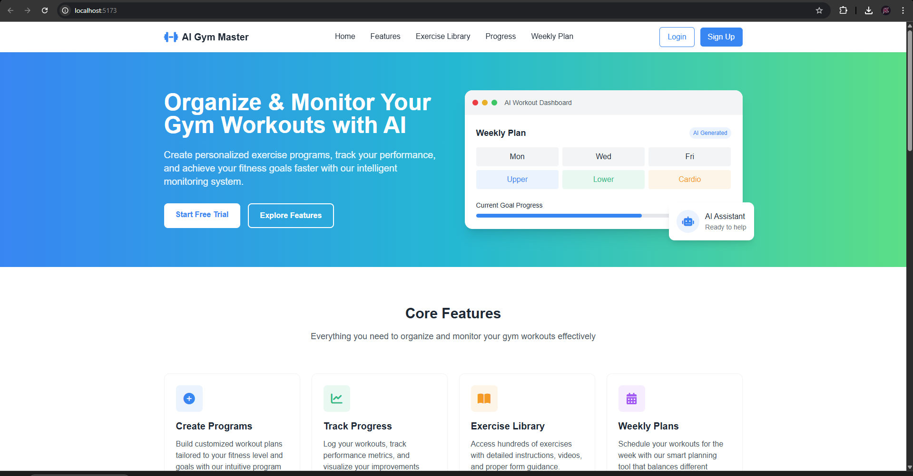
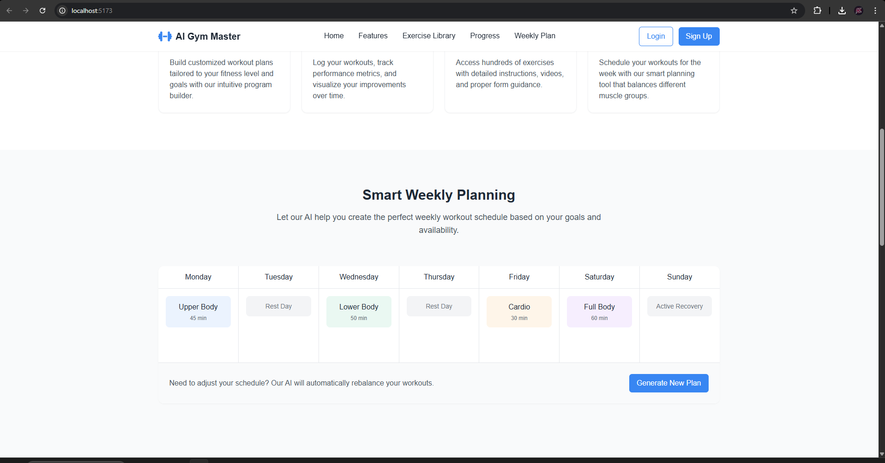
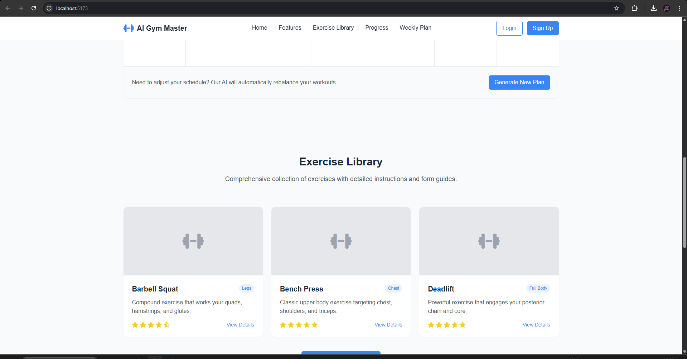
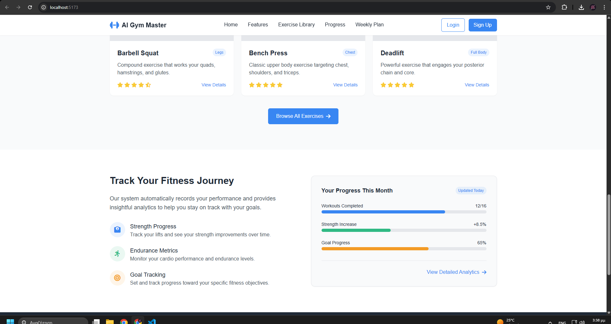
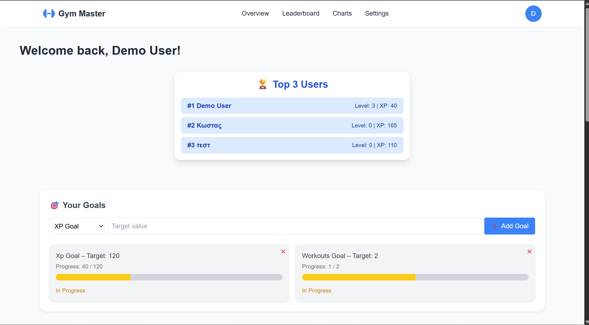

# 🏋️‍♂️ AI Gym Master

**AI Gym Master** είναι μια web εφαρμογή για την **οργάνωση και παρακολούθηση προπονήσεων**, βασισμένη σε React και Node.js. Στόχος είναι η παροχή ενός έξυπνου συστήματος που βοηθά τους χρήστες να δημιουργούν πλάνα άσκησης, να παρακολουθούν την πρόοδο τους και να πετυχαίνουν τους στόχους τους.

---

## 🚀 Demo (τοπικά)

```bash
git clone https://github.com/Aggelos02/erg_gymnastikh.git
cd erg_gymnastikh

# Server
cd server
npm install
npm run dev

# Client (σε νέο τερματικό)
cd ../client
npm install
npm run dev
```

---

## ⚙️ Τεχνολογίες
- **Frontend**: React, Vite, TailwindCSS
- **Backend**: Node.js, Express.js
- **Database**: SQLite
- **Authentication**: bcrypt, localStorage
- **UI Icons**: Font Awesome

---

## 🧩 Λειτουργίες

### 👤 Διαχείριση Χρηστών
- Εγγραφή, σύνδεση, αποσύνδεση
- Επαναφορά κωδικού (χωρίς email)
- Δυναμική εμφάνιση κουμπιών ανά login status
- Διαγραφή λογαριασμού

### 🏋️ Προγράμματα & Ασκήσεις
- Προσθήκη, προβολή και διαγραφή ασκήσεων
- Προβολή βιβλιοθήκης ασκήσεων
- Οργάνωση εβδομαδιαίου πλάνου

### 📈 Παρακολούθηση Προόδου
- Δείκτες: Workouts Completed, Strength Increase, Goal Progress
- Δυναμικές μπάρες προόδου

### 🏆 Gamification
- ✅ Οπτική αναπαράσταση προόδου
- 🔜 (υπό ανάπτυξη) Leaderboard & σύστημα επιπέδων XP

---

## 🔄 API Endpoints

### 🧍‍♂️ Users
| Μέθοδος | Endpoint | Περιγραφή |
|--------|----------|-----------|
| POST | `/api/register` | Δημιουργία νέου χρήστη |
| POST | `/api/login` | Είσοδος χρήστη |
| POST | `/api/reset-password` | Επαναφορά κωδικού |
| DELETE | `/api/delete/:id` | Διαγραφή χρήστη |

### 🏋️‍♀️ Exercises
| Μέθοδος | Endpoint | Περιγραφή |
|--------|----------|-----------|
| GET | `/api/exercises` | Λήψη όλων των ασκήσεων |
| POST | `/api/exercises` | Προσθήκη νέας άσκησης |
| DELETE | `/api/exercises/:id` | Διαγραφή άσκησης χρήστη |

---

## 🗃️ Δομή Φακέλων

```
erg_gymnastikh/
├── client/ # React frontend
│ ├── public/
│ └── src/
│ ├── assets/
│ ├── components/
│ ├── context/
│ ├── pages/
│ ├── App.jsx
│ ├── main.jsx
│ └── app.css
│
├── server/ # Express backend
│ ├── db/
│ ├── routes/
│ ├── index.js
│ └── schema.js
│
├── screenshots/ # Εικόνες για το README
├── ai-gym.db # SQLite database
├── README.md
├── .nojekyll
└── package.json
```

---

## 🧠 Σχέσεις Βάσης (ERD)

**users**
- id (PK)
- username
- email
- password

**exercises**
- id (PK)
- user_id (FK → users.id)
- name
- category
- difficulty

➤ Κάθε άσκηση σχετίζεται με έναν συγκεκριμένο χρήστη.  
➤ Υποστήριξη πολλών ασκήσεων ανά χρήστη.

---

## 📸 Screenshots

### Αρχική Σελίδα / Hero Section


### Εβδομαδιαίο Πλάνο (Weekly Plan)


### Βιβλιοθήκη Ασκήσεων


### Προβολή Προόδου Χρήστη


### Footer και Τελική Ενότητα


### Dashboard Preview


---

## 👨‍💻 Συμμετέχοντες

| Όνομα | GitHub |
| Άγγελος | [@Aggelos02](https://github.com/Aggelos02) |
| Κώστας | [@Konstantinos820](https://github.com/Konstantinos820) |

---

## 📄 Άδεια Χρήσης

© 2025 AI Gym Master. All rights reserved.
