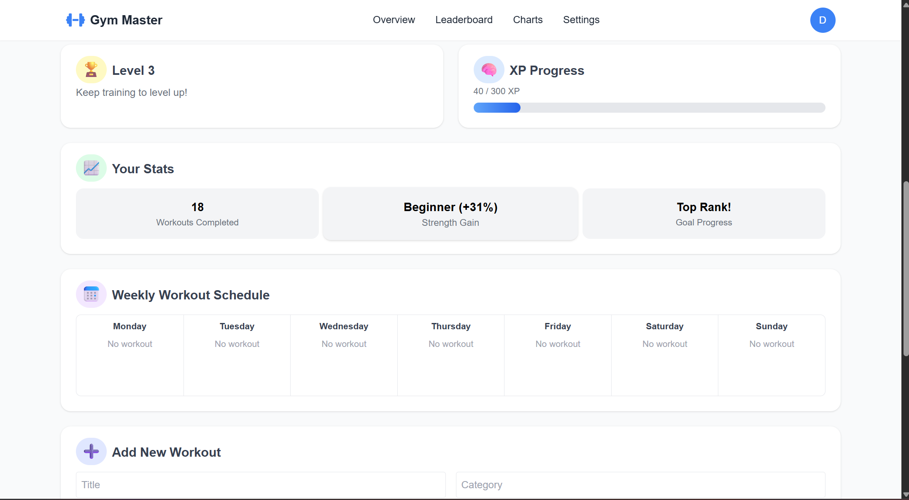
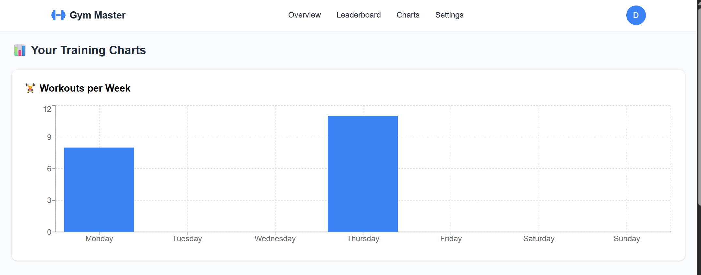
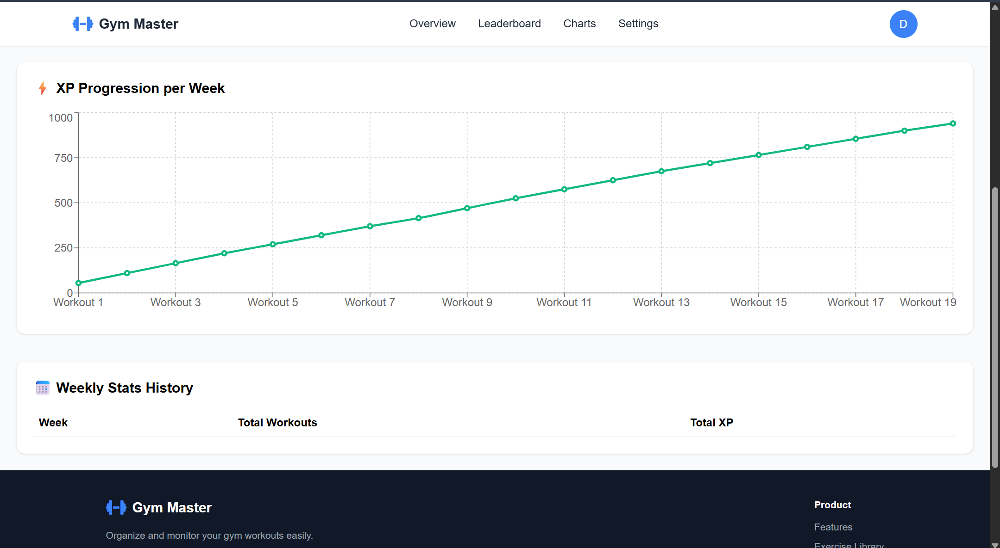
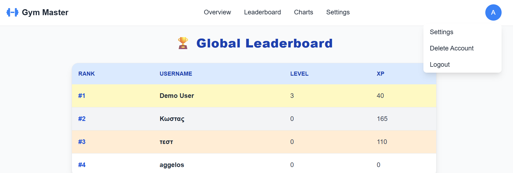

# 🏋️‍♂️ Gym Master

Το **Gym Master** είναι μια ολοκληρωμένη web εφαρμογή για την οργάνωση και παρακολούθηση προπονήσεων. Είναι βασισμένη σε **React (frontend)** και **Node.js + Express (backend)** με **SQLite** βάση δεδομένων. Περιλαμβάνει σύστημα XP/Level, στατιστικά, δυναμική βιβλιοθήκη ασκήσεων και διαδραστικό εβδομαδιαίο πρόγραμμα.

---


## ✅ Προαπαιτούμενα
Για να τρέξει η εφαρμογή σε νέο υπολογιστή χρειάζεστε:

- [Node.js](https://nodejs.org/) (v18 ή νεότερο)
- npm (v9 ή νεότερο)
- Git

Μπορείτε να ελέγξετε τις εκδόσεις με:
```bash
node -v
npm -v
```

---

## 🚀 Demo (τοπικά)

### Κλωνοποίηση του αποθετηρίου:
```bash
git clone https://github.com/Aggelos02/erg_gymnastikh.git
cd erg_gymnastikh


### Εκκίνηση Backend:

cd server
npm install
npm run dev

Ο backend server τρέχει στη θύρα `http://localhost:3001`

### Εκκίνηση Frontend (σε νέο τερματικό):

cd client
npm install
npm run dev
```
Το frontend τρέχει στη θύρα `http://localhost:5173`

📦 Βασικά Πακέτα που χρησιμοποιούνται
Client (/client)

- React
- react-router-dom
- axios
- react-chartjs-2
- chart.js
- tailwindcss
- @fortawesome/fontawesome-free

Server (/server)
- express
- sqlite3
- bcrypt
- nodemailer

❗ Troubleshooting
Αν δεν ανοίγει η εφαρμογή, βεβαιωθείτε ότι:
  - Έχετε τρέξει npm install και στα δύο folders (client και server)
  - Έχετε ανοίξει δύο τερματικά: ένα για backend (npm run dev στο /server) και ένα για frontend (npm run dev στο /client)
  - Το Node.js είναι εγκατεστημένο
Αν δείτε σφάλμα για λείπον πακέτο, δοκιμάστε:

npm install <package-name>
---

## ⚙️ Τεχνολογίες

- **Frontend**: React, Vite, TailwindCSS
- **Backend**: Node.js, Express.js
- **Database**: SQLite
- **Authentication**: bcrypt, localStorage
- **UI Icons**: Font Awesome

---

## 🧩 Λειτουργίες

### 👤 Διαχείριση Χρηστών
- Εγγραφή, Σύνδεση, Αποσύνδεση
- Επαναφορά Κωδικού (χωρίς email token)
- Διαγραφή Λογαριασμού
- Τοπική αποθήκευση session (localStorage)

### 🏋️ Προγράμματα & Ασκήσεις
- Προσθήκη, Προβολή και Διαγραφή Ασκήσεων
- Εβδομαδιαίο Πλάνο Προπονήσεων (Smart Weekly Schedule)
- Ομαδοποίηση ασκήσεων ανά ημέρα

### 📈 Παρακολούθηση Προόδου
- Workouts Completed
- Strength Gain (βάσει XP)
- Goal Progress με συγκριτικό πίνακα
- Visual XP Progress Bar

### 🏆 Gamification
- Σύστημα XP και Επίπεδων
- Κουμπί "🏋️ Earn XP" σε κάθε workout
- Αυτόματη αναβάθμιση level κάθε 300 XP
- 🔥 Leaderboard με Top 3 Χρήστες
- ⚖️ Υποστήριξη ισοβαθμιών

---

## 🔄 API Endpoints

### 🧍‍♂️ Users
| Μέθοδος | Endpoint                  | Περιγραφή                  |
|---------|---------------------------|----------------------------|
| POST    | /api/register             | Δημιουργία νέου χρήστη     |
| POST    | /api/login                | Είσοδος χρήστη             |
| POST    | /api/reset-password       | Επαναφορά κωδικού          |
| DELETE  | /api/delete-user/:id      | Διαγραφή χρήστη            |
| GET     | /api/users                | Λήψη όλων των χρηστών      |
| GET     | /api/leaderboard          | Top 3 χρήστες βάσει XP     |

### 🏋️‍♀️ Workouts
| Μέθοδος | Endpoint                  | Περιγραφή                                |
|---------|---------------------------|-------------------------------------------|
| GET     | /api/workouts/:userId     | Λήψη προπονήσεων χρήστη                  |
| POST    | /api/workouts             | Προσθήκη νέας προπόνησης                 |
| DELETE  | /api/delete-workout/:id   | Διαγραφή προπόνησης                      |
| POST    | /api/earn-xp-and-delete   | Earn XP και διαγραφή workout            |
| POST    | /api/update-xp            | Προσθήκη XP χωρίς διαγραφή              |

### 🧠 Exercises
| Μέθοδος | Endpoint              | Περιγραφή                  |
|---------|-----------------------|----------------------------|
| GET     | /api/exercises        | Λήψη όλων των ασκήσεων     |
| POST    | /api/exercises        | Προσθήκη νέας άσκησης      |
| DELETE  | /api/exercises/:id    | Διαγραφή άσκησης           |

---

## 🗃️ Δομή Φακέλων

```
erg_gymnastikh/
├── client/               # React frontend
│   ├── public/
│   └── src/
│       ├── components/   # Leaderboard, ProtectedRoute, κ.ά.
│       ├── pages/        # Dashboard, Login, Register
│       ├── App.jsx, main.jsx
│       └── styles/
│
├── server/               # Express backend
│   ├── index.js          # Κύριο αρχείο API
│   ├── gym.db            # SQLite DB
│   └── schema.js         # Δημιουργία πινάκων
│
├── screenshots/          # Εικόνες README
├── README.md
└── package.json
```

---

## 🧠 Σχέσεις Βάσης Δεδομένων (ERD)

- **users**: id, username, email, password, xp, level  
- **workouts**: id, user_id, title, category, duration, date, notes  
- **exercises**: id, name, category, description  

➤ Κάθε άσκηση σχετίζεται με έναν συγκεκριμένο χρήστη  
➤ Υποστήριξη πολλών ασκήσεων ανά χρήστη

---

## 📸 Screenshots

### 🏠 Αρχική Σελίδα / Hero Section  


### 🔐 Σύνδεση Χρήστη / Login Page  


### 🎯 Goal Tracker / Σύστημα Στόχων  


### 📈 Dashboard / Progress + Stats + Schedule  


### 📊 Workouts per Week / Γράφημα Προπονήσεων  


### ⚡ XP Progression / Γράφημα Εμπειρίας  


### 🏆 Leaderboard / Κατάταξη Χρηστών  



---

## 👨‍💻 Συμμετέχοντες

| Όνομα | GitHub |
|-------|--------|
| Άγγελος Μπλλόκου ΑΜ 2519 | [@Aggelos02](https://github.com/Aggelos02) |
| Κωνσταντίνος Παππάς ΑΜ 2553 | [@Konstantinos820](https://github.com/Konstantinos820) |

---

## 📄 Άδεια Χρήσης

© 2025 Gym Master. All rights reserved.
